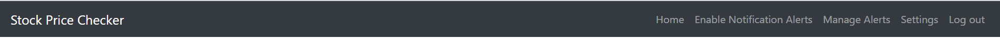
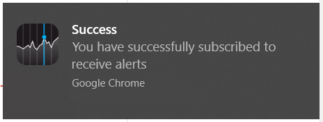
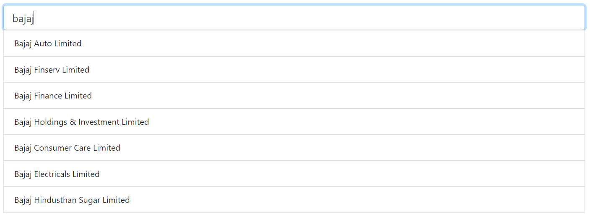
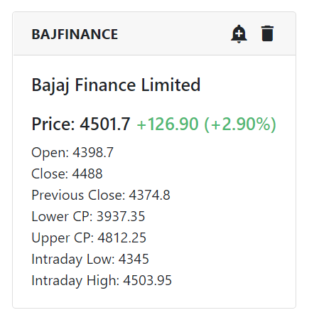
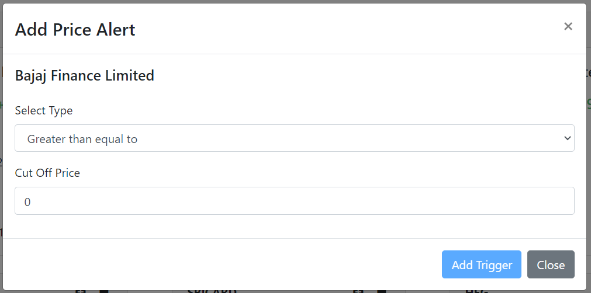

# Stock Price Checker

This app was created in order to monitor stocks listed on NSE.

Using this app, you'll be able to check the real time price of a stock by adding it to your watchlist.

Also, you'll be able to set alerts for a given stock.

So when the price of a stock reaches above or below a threshold value, you'll receive a push notification.

It's a Progressive Web App, hence it can be used on both Desktop/Mobiles.

### Application architecture is divided into two parts.

1. Server
2. Client

##### This repository deals only with client side of the app.

In order to set up the application, Clone it to you local machine.

Create a file called ".env-cmdrc" in the root folder of the repository (outside src) folder.

And fill in the following details

```JavaScript

{
    "dev": {
        "REACT_APP_BASE_URL": "",
        "REACT_APP_VAPID_PUBLIC_KEY": "",
        "REACT_APP_HOSTED_URL": ""
    },
    "prod":{
        "REACT_APP_BASE_URL": "",
        "REACT_APP_VAPID_PUBLIC_KEY": "",
        "REACT_APP_HOSTED_URL": ""
    }
}

```

>dev is used for setting up application during development mode and prod is used for creating a production build.

REACT_APP_BASE_URL -> Refers to the server URL where the Backend Node JS server is running. More on that in server respostory. Example: http://localhost:7000

REACT_APP_VAPID_PUBLIC_KEY -> Refers to the VAPID Public Key used for setting up subscriptions for push notifications. This can be generated from the server side app. Read the documentation for Server App for this.

REACT_APP_HOSTED_URL -> Refers to the URL which should be opened when a notification is clicked. Ideally it should be >someurl.com/stocklist
as 'stockList' is the page where all the list of stocks are displayed

Once the file is created, you can start the application locally on your machine by running

>npm run start-dev

Server App should be running in background in order for this to work.

It's best to use Google Chrome to use this application.

In order to receive Notification alerts, Service worker (SW) must be registered. SW only works in Production build for React app.

So compile a production build to test notifications by running

> npm run build-prod

And paste the contents of build folder inside server folder as 'build-client'.

Once the application is started, Click on "Enable Notification Alerts



You should receive a system notification if subscription was set correctly.



Now add a stock to your watch list by entering a company name in search box



The stock would be added successfully to your watchlist.



Click on Notification button (bell icon) to set a alert for the stock. 



Specify the type as greater than or lesser than and a cut off price. Click Add trigger.

After subscription is set, you would be able to get alerts for a stock and receive successful notifications.

This app can also be setup on your mobile phone. Just delpoy the app on a server, something like (heroku or netlify) and open the deployed URL in chrome. 

Since it's PWA, you'll get an option to add the app to your home screen. From there it can be used as a native app without opening the browser every time. Now you can tap on the notification alerts to open the stock watchlist.

This app also updates stock prices added to watchlist in real time during market hours (9AM - 4 PM) [can be configured in the server app]